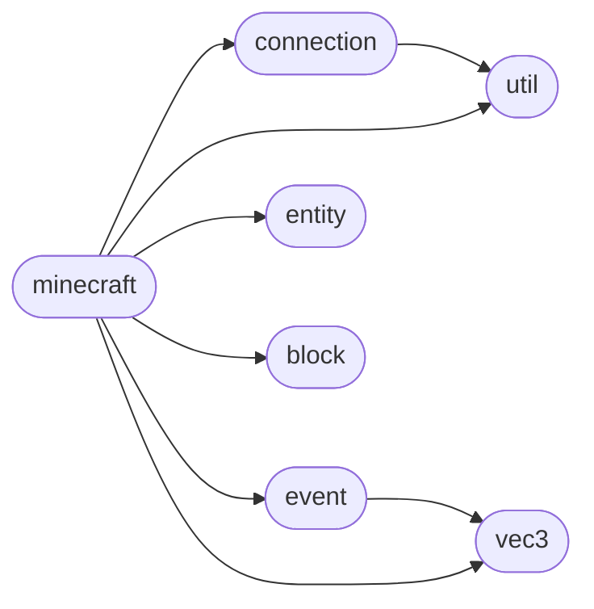

# Code Overview

[_Documentation generated by Documatic_](https://www.documatic.com)

<!---Documatic-section-Codebase Structure Python-start--->
## Codebase Structure Python

The codebase has a flat structure, with 8 code files.

<!---Documatic-block-system_architecture-start--->

<!---Documatic-block-system_architecture-end--->

# #
<!---Documatic-section-Codebase Structure Python-end--->

<!---Documatic-section-Important Functions-start--->
## Important Functions

<!---Documatic-block-important_funcs-start--->
<!---Documatic-block-most_used_funcs-start--->
### Most Utilised Functions

* [mcpi.util.flatten_parameters_to_bytestring](4-mcpi_util.md#mcpi.util.flatten_parameters_to_bytestring) (1 times)
* [mcpi.util.flatten](4-mcpi_util.md#mcpi.util.flatten) (1 times)
<!---Documatic-block-most_used_funcs-end--->
<!---Documatic-block-important_funcs-end--->

# #
<!---Documatic-section-Important Functions-end--->

<!---Documatic-section-Class Hierarchy-start--->
## Class Hierarchy

<!---Documatic-block-Exception-start--->

	
<code>Exception</code> (Click to Expand!)

* mcpi.connection.RequestError

<!---Documatic-block-Exception-end--->

<!---Documatic-block-mcpi.minecraft.CmdPositioner-start--->

	
<code>mcpi.minecraft.CmdPositioner</code> (Click to Expand!)

* mcpi.minecraft.CmdEntity
* mcpi.minecraft.CmdPlayer

<!---Documatic-block-mcpi.minecraft.CmdPositioner-end--->

# #
<!---Documatic-section-Class Hierarchy-end--->

[_Documentation generated by Documatic_](https://www.documatic.com)