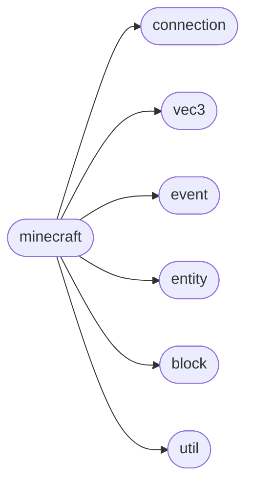

# Mcpi Minecraft

[_Documentation generated by Documatic_](https://www.documatic.com)

<!---Documatic-section-Codebase Structure-start--->
## Codebase Structure

<!---Documatic-block-system_architecture-start--->

<!---Documatic-block-system_architecture-end--->

# #
<!---Documatic-section-Codebase Structure-end--->

<!---Documatic-section-mcpi.minecraft.intFloor-start--->
## [mcpi.minecraft.intFloor](3-mcpi_minecraft.md#mcpi.minecraft.intFloor)

<!---Documatic-section-intFloor-start--->


### Object Calls

* [mcpi.util.flatten](4-mcpi_util.md#mcpi.util.flatten)

<!---Documatic-block-mcpi.minecraft.intFloor-start--->
<details>
	<summary><code>mcpi.minecraft.intFloor</code> code snippet</summary>

```python
def intFloor(*args):
    return [int(math.floor(x)) for x in flatten(args)]
```
</details>
<!---Documatic-block-mcpi.minecraft.intFloor-end--->
<!---Documatic-section-intFloor-end--->

# #
<!---Documatic-section-mcpi.minecraft.intFloor-end--->

[_Documentation generated by Documatic_](https://www.documatic.com)