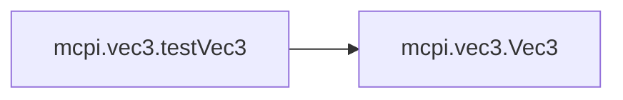

# Mcpi Vec3

[_Documentation generated by Documatic_](https://www.documatic.com)

<!---Documatic-section-Codebase Structure-start--->
## Codebase Structure

<!---Documatic-block-system_architecture-start--->
```mermaid
None
```
<!---Documatic-block-system_architecture-end--->

# #
<!---Documatic-section-Codebase Structure-end--->

<!---Documatic-section-mcpi.vec3.testVec3-start--->
## [mcpi.vec3.testVec3](5-mcpi_vec3.md#mcpi.vec3.testVec3)

<!---Documatic-section-testVec3-start--->


### Object Calls

* mcpi.vec3.Vec3

<!---Documatic-block-mcpi.vec3.testVec3-start--->
<details>
	<summary><code>mcpi.vec3.testVec3</code> code snippet</summary>

```python
def testVec3():
    it = Vec3(1, -2, 3)
    assert it.x == 1
    assert it.y == -2
    assert it.z == 3
    assert it.x != -1
    assert it.y != +2
    assert it.z != -3
    clone = it.clone()
    assert it == clone
    it.x += 1
    assert it != clone
    a = Vec3(10, -3, 4)
    b = Vec3(-7, 1, 2)
    c = a + b
    assert c - a == b
    assert c - b == a
    assert a + a == a * 2
    assert a - a == Vec3(0, 0, 0)
    assert a + -a == Vec3(0, 0, 0)
    e = eval(repr(it))
    assert e == it
```
</details>
<!---Documatic-block-mcpi.vec3.testVec3-end--->
<!---Documatic-section-testVec3-end--->

# #
<!---Documatic-section-mcpi.vec3.testVec3-end--->

[_Documentation generated by Documatic_](https://www.documatic.com)